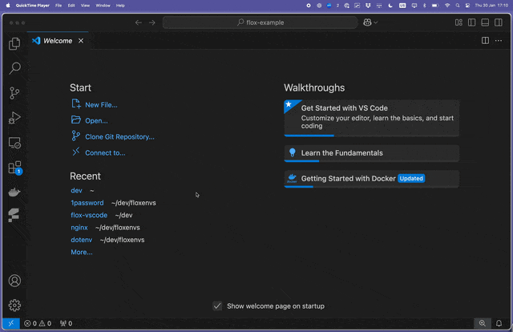

# Bring Flox to VSCode

[Flox](https://flox.dev) is a virtual environment and package manager all in
one. With Flox you create environments that layer and replace dependencies just
where it matters, making them portable across the full software lifecycle.

`flox-vscode` is a VSCode extension that integrates Flox environments with
VSCode.

✨ Flox documentation can be found [here](https://flox.dev/docs).

  

## ⭐️ Contribute

We welcome contributions to this project. Please read the [Contributor
guide](./CONTRIBUTING.md) first.

## 🪪 License

The Flox CLI is licensed under the GPLv2. See [LICENSE](./LICENSE).
