# Flox VSCode Extension - Activation Flow

This document explains the complete activation flow of the Flox VSCode extension, including all phases, state management, and IPC communication.

## Overview

The Flox extension activation is a multi-phase process that:
1. Detects if a Flox environment exists in the workspace
2. Optionally prompts the user to activate
3. Spawns a background `flox activate` process
4. Captures environment variables via IPC
5. Applies those variables to VSCode terminals

## Architecture Diagram

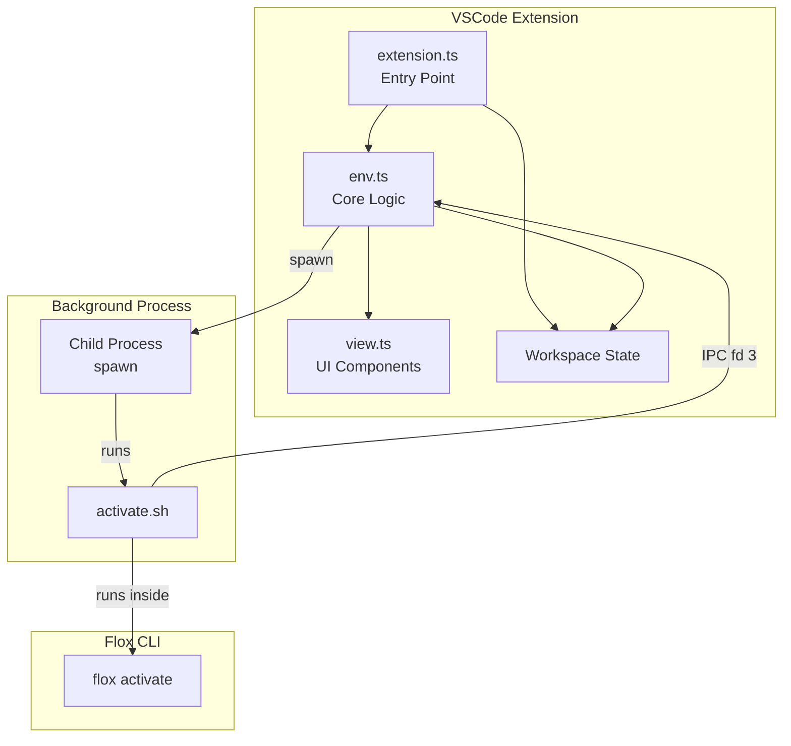

## Activation Phases

### Phase 1: User Initiates Activation

When the user clicks "Activate & Restart" or runs the `flox.activate` command:

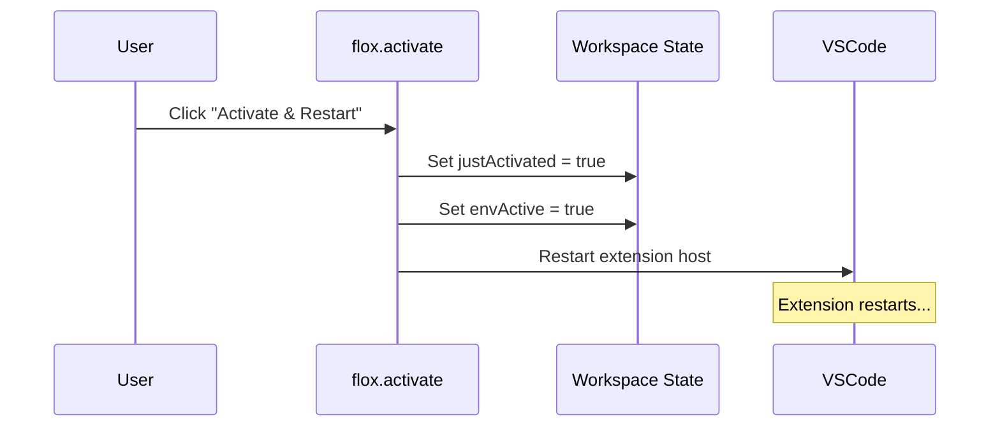

**Code location:** `src/extension.ts` - `flox.activate` command handler

```typescript
// Set flag to indicate we just activated
await context.workspaceState.update('flox.justActivated', true);
await context.workspaceState.update('flox.envActive', true);

// Restart extension host (local) or reload window (remote)
if (vscode.env.remoteName) {
  await vscode.commands.executeCommand('workbench.action.reloadWindow');
} else {
  await vscode.commands.executeCommand('workbench.action.restartExtensionHost');
}
```

### Phase 2: Extension Restart & Post-Activation

After restart, the extension checks if it was just activated:

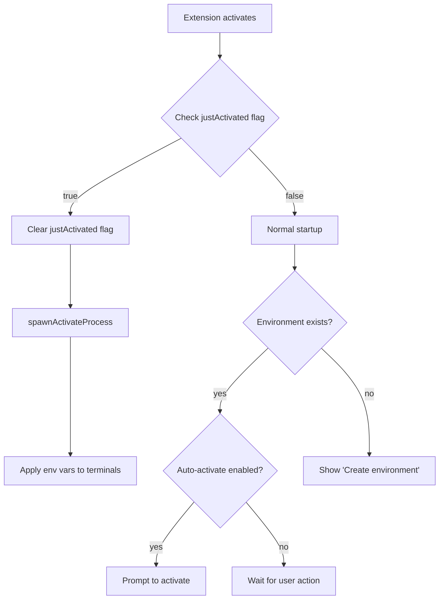

**Code location:** `src/extension.ts` - post-activation flow

```typescript
const justActivated = context.workspaceState.get<boolean>('flox.justActivated');
if (justActivated) {
  // Clear the flag
  await context.workspaceState.update('flox.justActivated', false);

  // Spawn the activation process
  await env.spawnActivateProcess((envVars) => {
    env.applyEnvironmentVariables(envVars);
  });
}
```

### Phase 3: Background Process Spawning

The extension spawns `flox activate -- activate.sh` as a long-running child process:

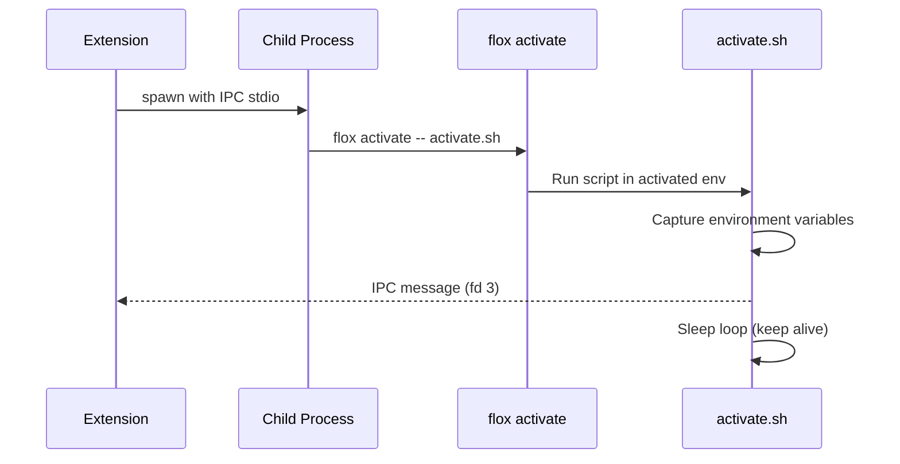

**Code location:** `src/env.ts` - `spawnActivateProcess()`

```typescript
async spawnActivateProcess(callback: (envVars: Record<string, string>) => void): Promise<void> {
  const scriptPath = path.join(this.context.extensionPath, 'scripts', 'activate.sh');

  this.activateProcess = spawn('flox', ['activate', '--', scriptPath], {
    cwd: this.workspaceUri?.fsPath,
    stdio: ['pipe', 'pipe', 'pipe', 'ipc'],  // fd 3 for IPC
    env: { ...process.env, FLOX_NO_INTERACTIVE: '1' }
  });

  // Listen for IPC messages from activate.sh
  this.activateProcess.on('message', (message: any) => {
    if (message.action === 'ready' && message.env) {
      callback(message.env);
    }
  });
}
```

### Phase 4: IPC Communication

The `activate.sh` script captures environment variables and sends them back via IPC:

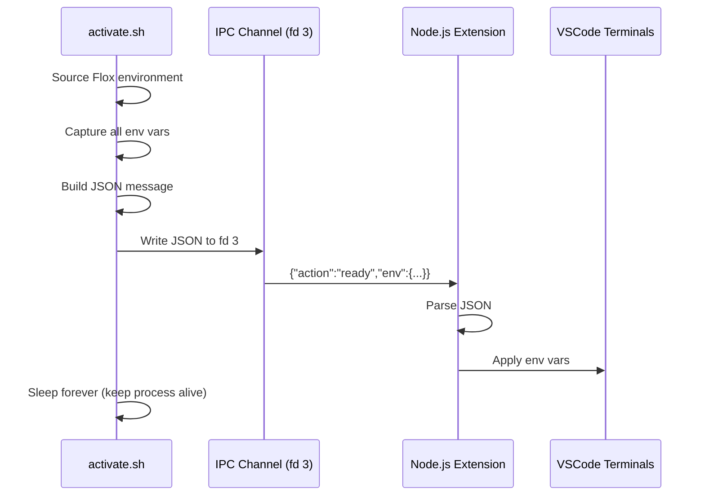

**Code location:** `scripts/activate.sh`

```bash
#!/usr/bin/env bash

# Capture all environment variables
declare -A env_vars
while IFS='=' read -r key value; do
  env_vars["$key"]="$value"
done < <(env)

# Build JSON message
json='{"action":"ready","env":{'
# ... build env JSON ...
json+='}}'

# Send via IPC (file descriptor 3)
echo "$json" >&3

# Keep process alive to maintain activation
while true; do
  sleep 86400
done
```

### Phase 5: Environment Variable Application

The extension applies captured env vars to VSCode's terminal environment:

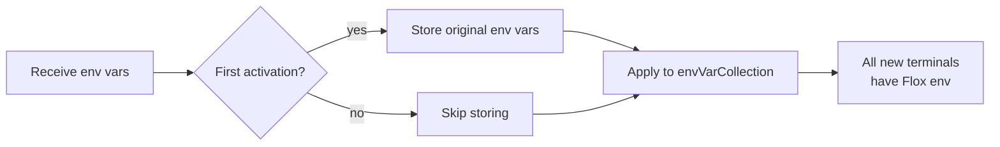

**Code location:** `src/env.ts` - `applyEnvironmentVariables()`

```typescript
applyEnvironmentVariables(envVars: Record<string, string>): void {
  const collection = this.context.environmentVariableCollection;

  // Store original values on first activation
  if (!this.originalEnvVars) {
    this.originalEnvVars = { ...process.env };
  }

  // Apply each env var
  for (const [key, value] of Object.entries(envVars)) {
    collection.replace(key, value);
  }

  this.activatedEnvVars = envVars;
}
```

## State Management

### Workspace State Keys

| Key | Type | Description |
|-----|------|-------------|
| `flox.justActivated` | boolean | Set before restart, cleared after spawn |
| `flox.envActive` | boolean | Whether environment is currently active |
| `flox.autoActivate` | boolean/undefined | User preference for auto-activation |
| `flox.activatePid` | number | PID of background activate process |
| `flox.mcpSuggestionShown` | boolean | Whether MCP suggestion was shown |

### Context Keys (for UI conditions)

| Key | Type | Description |
|-----|------|-------------|
| `flox.isInstalled` | boolean | Whether Flox CLI is installed |
| `flox.envExists` | boolean | Whether .flox directory exists |
| `flox.envActive` | boolean | Whether environment is activated |
| `flox.hasPkgs` | boolean | Whether packages are installed |
| `flox.mcpAvailable` | boolean | Whether flox-mcp is available |
| `flox.copilotInstalled` | boolean | Whether GitHub Copilot is installed |

## Complete Activation Flow Diagram

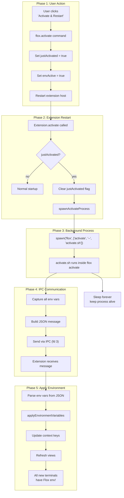

## Deactivation Flow

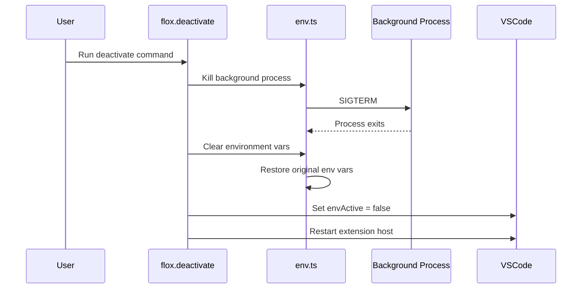

## File Watchers

The extension watches for changes to Flox environment files:

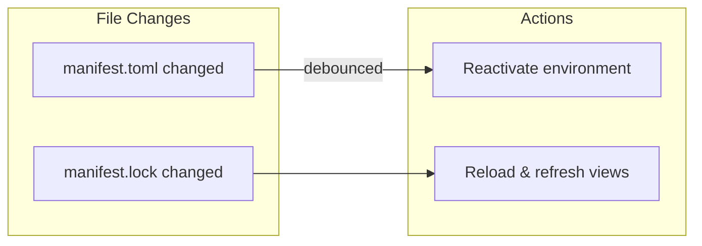

| Pattern | Action |
|---------|--------|
| `**/.flox/env/manifest.toml` | Trigger reactivation (debounced) |
| `**/.flox/env/manifest.lock` | Trigger reload (refresh views) |

## Debugging Tips

### Enable Logging

All activation steps are logged to the "Flox" output channel with prefixes:

| Prefix | Description |
|--------|-------------|
| `[STEP 1]` | User activation command |
| `[STEP 2]` | Post-activation flow |
| `[STEP 3]` | Reload/refresh |
| `[SPAWN]` | Background process spawning |
| `[RELOAD]` | Manifest parsing |
| `[MCP]` | MCP server detection |

### Common Issues

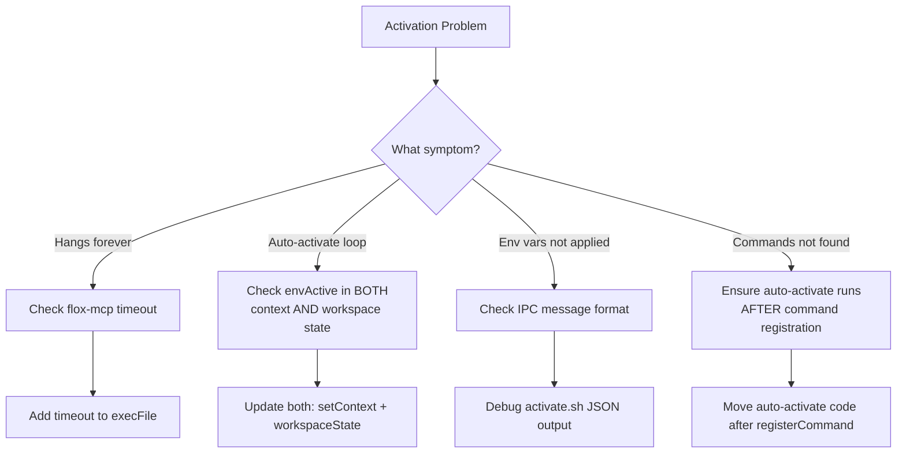

### Testing Activation

Use the Happy Path integration tests:
```bash
npm run test:integration
```

The tests use VSCode commands to simulate user interactions:
```typescript
await vscode.commands.executeCommand('flox.init');
await vscode.commands.executeCommand('flox.activate');
```

## Performance Considerations

1. **MCP checks run in background** - Don't block activation for flox-mcp detection
2. **Skip redundant reloads** - When `justActivated` is true, skip the initial reload
3. **Debounce manifest changes** - Avoid rapid reactivation on file saves
4. **Timeout external commands** - Always set timeouts on CLI calls (e.g., 2s for version checks)

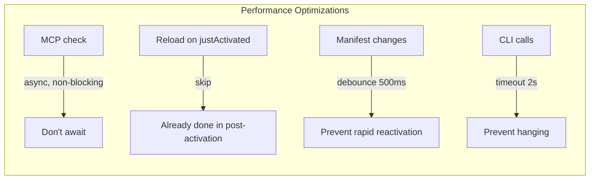
